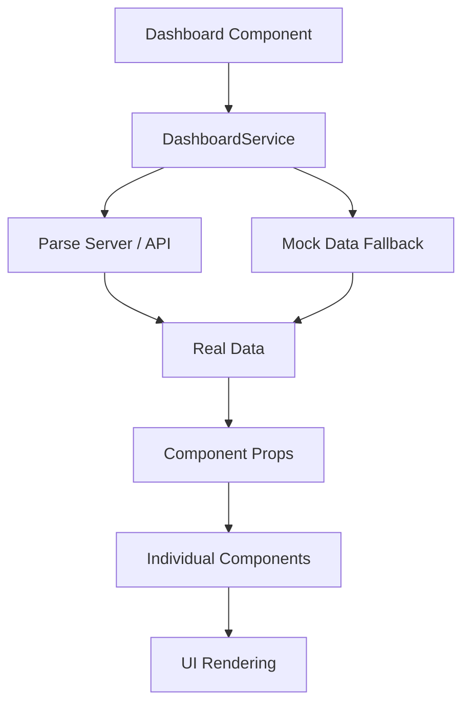

# PsyPsy CMS Enhanced Dashboard

## Overview

The PsyPsy CMS Enhanced Dashboard provides a comprehensive view of the mental health professionals management platform. It features real-time statistics, activity monitoring, professional network management, service analytics, system health monitoring, and demographic insights.

## Dashboard Components

### 1. Statistics Cards (`StatsCards`)
**Location**: `src/layouts/dashboard/components/StatsCards/`

Displays key performance indicators:
- **Total Clients**: Current number of active clients
- **Active Requests**: Pending appointment requests requiring attention
- **Weekly Appointments**: Scheduled appointments for the current week
- **Response Rate**: Platform response rate percentage

**Features**:
- Real-time data updates
- Growth indicators with color-coded trends
- Urgent request highlighting

### 2. Recent Activity (`RecentActivity`)
**Location**: `src/layouts/dashboard/components/RecentActivity/`

Shows recent platform activity in two sections:
- **Recent Appointment Requests**: Latest client requests with status indicators
- **Upcoming Scheduled Appointments**: Confirmed appointments with meeting preferences

**Features**:
- Status-based color coding (New, In Review, Matched, Urgent)
- Meeting preference indicators (Online/In-Person)
- Quick action buttons for viewing details
- Formatted timestamps

### 3. Professional Network Overview (`ProfessionalNetwork`)
**Location**: `src/layouts/dashboard/components/ProfessionalNetwork/`

Manages the professional network:
- Network statistics (Total, Active, Available)
- Recently joined professionals
- Top performing professionals with ratings

**Features**:
- Professional status tracking
- Performance metrics (completed sessions, ratings)
- Avatar display for visual identification
- Quick access to network management

### 4. Service Type Breakdown (`ServiceBreakdown`)
**Location**: `src/layouts/dashboard/components/ServiceBreakdown/`

Analyzes service distribution:
- Interactive doughnut chart showing service type distribution
- Detailed statistics with percentages
- Monthly trends and growth indicators

**Service Types Tracked**:
- Individual Therapy
- Couples Therapy
- Family Therapy
- Psychological Assessment
- Group Therapy

**Features**:
- Visual chart representation
- Percentage breakdowns
- Trend analysis (most popular, fastest growing)
- Average wait time tracking

### 5. Quick Actions Grid (`QuickActions`)
**Location**: `src/layouts/dashboard/components/QuickActions/`

Provides shortcuts to common tasks:
- Add Professional
- Review Requests
- Schedule Appointment
- Send Notification
- Generate Report
- Manage Billing
- System Settings
- Support Center

**Features**:
- Interactive hover effects
- Icon-based visual design
- Quick performance metrics
- Responsive grid layout

### 6. System Health & Alerts (`SystemHealth`)
**Location**: `src/layouts/dashboard/components/SystemHealth/`

Monitors platform health:
- System status indicators
- Performance metrics (CPU, Memory, Disk usage)
- Active alerts and notifications
- Service health monitoring

**Metrics Tracked**:
- System uptime
- Response time
- Active users
- Database health
- API health
- Resource utilization

### 7. Demographics (`Demographics`)
**Location**: `src/layouts/dashboard/components/Demographics/`

Provides demographic insights:
- Age group distribution with interactive charts
- Gender distribution with progress bars
- Geographic distribution across regions

**Features**:
- Visual bar chart for age groups
- Detailed percentage breakdowns
- Regional client distribution
- Responsive design for different screen sizes

## Data Service Architecture

### Dashboard Service (`DashboardService`)
**Location**: `src/services/dashboardService.js`

Centralized service for all dashboard data management:

**Key Methods**:
- `getDashboardStats()`: Fetches main statistics
- `getRecentActivity()`: Retrieves recent platform activity
- `getProfessionalNetwork()`: Gets professional network data
- `getServiceBreakdown()`: Analyzes service type distribution
- `getSystemHealth()`: Monitors system health metrics
- `getDemographics()`: Provides demographic insights

**Features**:
- Async/await pattern for data fetching
- Error handling with fallback to mock data
- Parallel data loading for performance
- Parse Server integration ready
- Mock data for development/testing

## Technical Implementation

### State Management
- React hooks (`useState`, `useEffect`) for component state
- Centralized data loading with error handling
- Loading states with progress indicators
- Error states with retry functionality

### Performance Optimizations
- Parallel API calls using `Promise.all()`
- Component-level data props to prevent unnecessary re-renders
- Efficient chart rendering with optimized data structures
- Responsive design for various screen sizes

### Error Handling
- Graceful fallback to mock data
- User-friendly error messages
- Retry functionality for failed requests
- Console logging for debugging

## Data Flow



## Usage

### Starting the Dashboard
```bash
npm run electron:dev
```

### Accessing Components
The dashboard is the default route and loads automatically when the application starts.

### Data Refresh
- Data loads automatically on component mount
- Manual refresh available through retry button on errors
- Real-time updates can be implemented with WebSocket connections

## Customization

### Adding New Components
1. Create component in `src/layouts/dashboard/components/`
2. Add data fetching method to `DashboardService`
3. Import and use in main dashboard layout
4. Update state management to include new data

### Modifying Existing Components
- Components accept data through props
- Styling uses Material-UI theme system
- Charts use the existing chart components from the template

### Data Integration
- Replace mock data methods in `DashboardService` with actual Parse queries
- Update API endpoints as needed
- Implement real-time data updates

## Dependencies

### Core Dependencies
- React 18+
- Material-UI (@mui/material)
- Parse SDK
- Chart.js (via existing chart components)

### Chart Components
- Uses existing Material Dashboard chart components
- `DefaultDoughnutChart` for service breakdown
- `VerticalBarChart` for demographics
- Progress bars for system metrics

## Future Enhancements

### Planned Features
1. **Real-time Updates**: WebSocket integration for live data
2. **Advanced Filtering**: Date range and category filters
3. **Export Functionality**: PDF/Excel export for reports
4. **Customizable Layout**: Drag-and-drop dashboard customization
5. **Mobile Optimization**: Enhanced mobile responsiveness
6. **Notification System**: Real-time alerts and notifications

### Performance Improvements
1. **Data Caching**: Implement caching for frequently accessed data
2. **Lazy Loading**: Load components on demand
3. **Virtual Scrolling**: For large data lists
4. **Progressive Loading**: Load critical data first

## Troubleshooting

### Common Issues
1. **Loading Errors**: Check network connectivity and API endpoints
2. **Chart Rendering**: Ensure chart data format matches expected structure
3. **Performance**: Monitor component re-renders and optimize props

### Debug Mode
Enable debug logging by setting `NODE_ENV=development` for detailed console output.

## Contributing

When adding new dashboard features:
1. Follow the existing component structure
2. Add appropriate error handling
3. Include mock data for development
4. Update this documentation
5. Test across different screen sizes

## License

This dashboard implementation is part of the PsyPsy CMS project and follows the same licensing terms. 